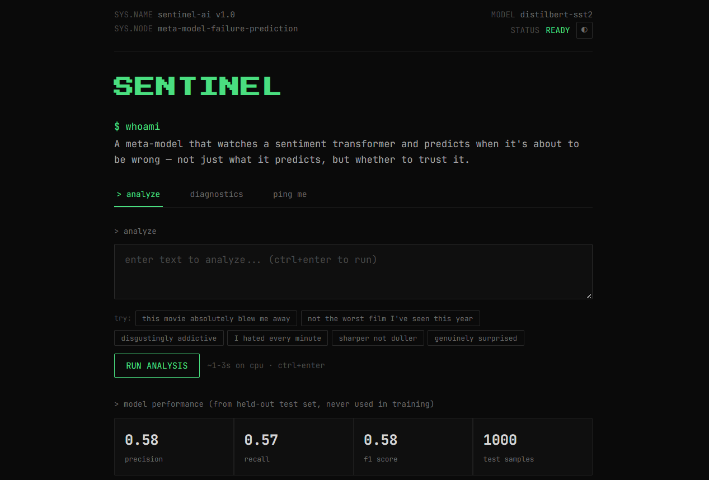
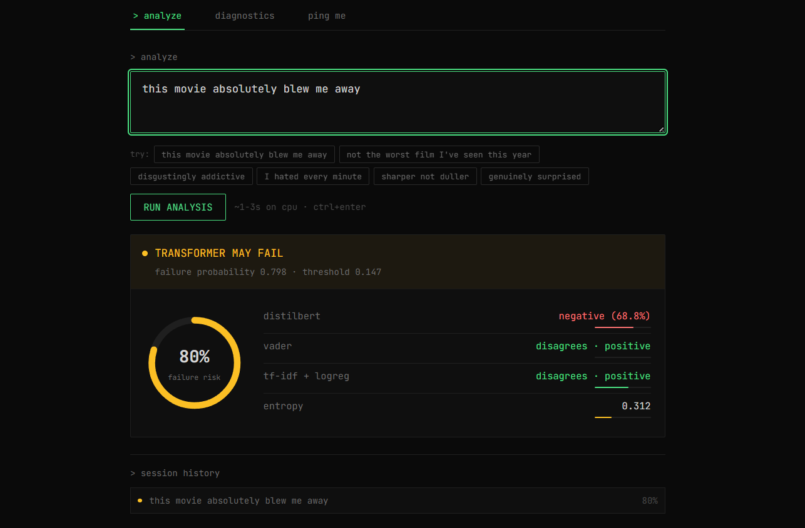

<div align="center">

# Sentinel AI (Transformer Failure Prediction)

**A meta-learning system that predicts when a sentiment transformer is about to be wrong.**

[](https://python.org)
[](https://pytorch.org)
[](https://huggingface.co/docs/transformers)
[](https://scikit-learn.org)
[](https://flask.palletsprojects.com)
[](https://docker.com)

> **Live Demo:** [https://huggingface.co/spaces/furged/sentinel-ai](https://huggingface.co/spaces/furged/sentinel-ai)
> 
> Production deployment running on Hugging Face Spaces using Docker.

</div>

---

## Features

- Predicts when DistilBERT is likely to fail
- Meta-learning failure prediction
- Multi-model ensemble (VADER, TF-IDF+LogReg, DistilBERT)
- Confidence-aware diagnostics
- Interactive Flask web interface
- Feedback collection via Resend
- Docker deployment on Hugging Face Spaces

---

## At a Glance

| | |
|---|---|
| **Training samples** | 18,125 |
| **Real BERT failures in training data** | 979 (5.4%) |
| **Curated hard examples** | 125 |
| **Negative-intensifier lexicon size** | 19 words |
| **Test set size** | 1,000 |
| **Test set precision** | 0.583 |
| **Test set recall** | 0.568 |
| **Test set F1** | 0.575 |
| **Decision threshold** | 0.107 (validation-tuned) |
| **Base model** | DistilBERT-SST2 (66M params) |
| **Meta-model** | Calibrated RandomForest (200 trees, depth 5) |
| **Meta-features** | 11 |
| **Adversarial noise injection rate** | 45% |

---

## The Problem

DistilBERT fine-tuned on SST-2 sentiment is strong, but not infallible.

| Metric | Value |
|---|---|
| Base model accuracy | ~95% |
| Base model failure rate | ~1 in 20 |
| Confidence on wrong predictions | Often >95% |

A model that's wrong 5% of the time *and confidently wrong* is dangerous in production if trusted blindly. Sentinel doesn't try to fix the base model, it learns to flag the failures before they're trusted.

---

## Architecture

```
Input Text
    │
    ├──► VADER (rule-based lexicon)
    ├──► TF-IDF + Logistic Regression
    └──► DistilBERT (fine-tuned SST-2)
              │
              ▼
    Feature Assembly (11 features)
              │
              ▼
        Meta-Model
   (Calibrated RandomForest)
              │
              ▼
     Failure Probability
```

### Meta-Features (11 total)

| # | Feature | Type |
|---|---|---|
| 1 | VADER prediction | binary |
| 2 | VADER compound score | float |
| 3 | LogReg prediction | binary |
| 4 | LogReg confidence | float |
| 5 | BERT prediction | binary |
| 6 | BERT confidence | float |
| 7 | BERT entropy | float |
| 8 | VADER ↔ LogReg disagreement | binary |
| 9 | LogReg ↔ BERT disagreement | binary |
| 10 | VADER ↔ BERT disagreement | binary |
| 11 | Negative-intensifier lexicon flag | binary |

---

## Model Iteration History

| Version | Approach | Precision | Recall | F1 |
|---|---|---|---|---|
| v1 (baseline) | LogReg + `class_weight=balanced`, 5k samples | 0.16 | 0.87 | 0.27 |
| v2 | Calibrated RandomForest, threshold tuning | 0.58 | 0.57 | 0.58 |
| v3 (current) | + 18k samples, intensifier lexicon feature | 0.58 | 0.57 | 0.58 |

v1 flagged ~20% of all inputs as failures when the true rate was ~4%, precision of 0.16 means 84% of its warnings were false alarms. v2/v3 brought precision to 0.58, a **3.6× improvement**.

---

## Training Data Composition

| Source | Count | Notes |
|---|---|---|
| SST-2 sampled | 18,000 | 45% adversarial noise injection (typos, casing, punctuation) |
| Curated hard examples | 125 | Negation, sarcasm-adjacent intensifiers, mixed sentiment |
| **Total** | **18,125** | |

**Example curated patterns:**

| Pattern | Example | True Label |
|---|---|---|
| Negation | "not the worst film I've seen this year" | positive |
| Intensifier-as-praise | "disgustingly addictive" | positive |
| Mixed sentiment | "flawed in execution, brilliant in ambition" | positive |
| Faint praise | "exceeded my admittedly low expectations" | positive |

---

## Tech Stack

<div align="center">

[](https://huggingface.co/distilbert-base-uncased-finetuned-sst-2-english)
[](https://github.com/cjhutto/vaderSentiment)
[](https://scikit-learn.org)
[](https://scikit-learn.org)

[](https://flask.palletsprojects.com)
[](https://gunicorn.org)
[](https://resend.com)

</div>

---

## Run Locally

**Requirements:** Python 3.11+, ~2GB free disk for model weights

```bash
git clone https://github.com/furged/meta-model-failure-prediction.git
cd meta-model-failure-prediction

pip install -r requirements.txt

# Create .env for the feedback form (optional)
cp .env.example .env
# edit .env and add your Resend API key

python app.py
```

Open `http://localhost:10000`. First request downloads DistilBERT weights (~260MB).

### Retraining the Meta-Model

```bash
pip install -r requirements-dev.txt

python -m src.data.build_meta_dataset   # rebuilds the 18k-sample dataset (slow, downloads SST-2 + runs BERT inference)
python -m src.models.meta_model          # retrains the meta-model, exports metrics.json
```

---

## Screenshots

### Dashboard


### Confidence Diagnostics


## Deployment

The application is deployed on **Hugging Face Spaces** using Docker. The deployment configuration includes:

| Setting | Value |
|---|---|
| Platform | Hugging Face Spaces (Docker SDK) |
| Port | 7860 |
| Workers | 1 (single model instance in memory) |
| Timeout | 120s |
| Base image | `python:3.11-slim` |
| Server | Gunicorn |
| Model pre-download | Baked into image at build time |

Required environment variable for the feedback form: `RESEND_API_KEY`

---

## Links

[](https://github.com/furged)
[](https://www.linkedin.com/in/anushka-shakya-profile/)
[](https://huggingface.co/spaces/furged/sentinel-ai)
